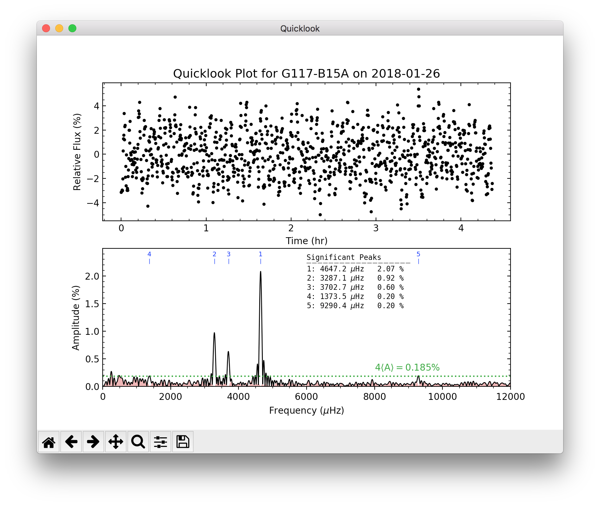
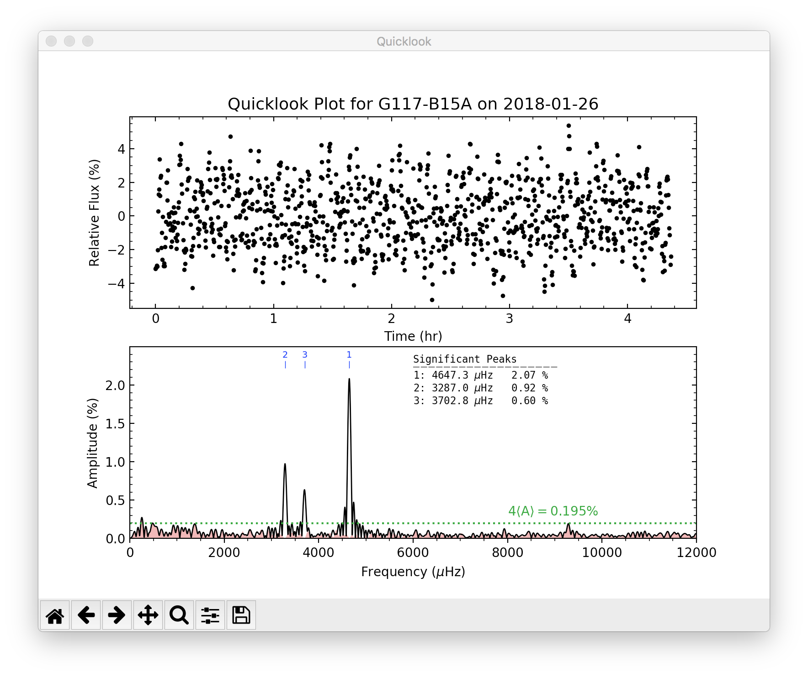

Additional Tools
================

Besides the main light curve extraction program (phot2lc) and the configuration program (photconfig), the phot2lc package also comes with a program for welding individual light curve files together (weldlc), and a program for generating light curve + periodogram plots using the .lc output files. This section provides information on how to use these tools.

* `weldlc`_
* `quicklook`_

weldlc
------

A program designed for combining individual phot2lc light curve (.lc) files into a single light curve file. This program behaves much like WQED's *weld* tool. Two command line options are available for this tool:

.. code-block:: text

  -f --infiles     Input files.
  -o --outfile     Output filename.

An example usage would look like:

.. code-block:: bash

  weldlc -f *.lc -o combined.lc

where *\*.lc* would provide as input every .lc file within the current folder, and *combined.lc* would be the name of the resulting file with the combined light curve. A welded light curve file will have the same four data columns as an original .lc file, but different header information. An example header is given below:

.. code-block:: text

  # Object     : G117-B15A                     # Name of Object
  # RA         : 09 24 15.27                   # Object Right Ascension
  # Dec        : +35 16 51.3                   # Object Declination
  # Date       : 2018-01-26                    # Mid-Exposure TDB Date at T0
  # Time       : 05:14:54.080                  # Mid-Exposure TDB Time at T0
  # BJED       : 2458144.718681479             # Mid-Exposure TDB JD at T0
  # WeldNum    : 2                             # Number of files welded
  # Npoints    : 3905                          # Number of data points
  # Tspan      : 1.14824075                    # Time spanned by data (days)
  # WeldDate   : 2020-07-13 06:04:11.493       # File creation date
  # Columns: Raw T-mid (s), BaryCorr T-mid (s), Rel. Flux, Rel. Flux Error

quicklook
---------

A program designed for quick analysis of phot2lc light curves and their periodograms. quicklook is also a command line tool with the following command line options:

.. code-block:: text

  -f --files      Input file(s) to perform quicklook on.
  -s --save       Whether to save the quicklook plot.
  -p --prewhiten  Whether to perform a pre-whitening sequence.
  -l --lower      Lower frequency limit for pre-whitening search (micro-Hertz, default=500).
  -u --upper      Upper frequency limit for pre-whitening search (micro-Hertz, default=100000).
  -n --num        Maximum number of pre-whitening iterations (default=10).
  -w --wqedlc     Whether the input file(s) are from WQED.

The *-s*, *-p*, and *-w* options don't require an actual input. When they are called, they automatically pass a boolean value of TRUE to the quicklook program.

The only required command line input is *-f*, which you use to specify the file, or files, you wish to perform a quicklook for. Quicklook will always display the resulting plot, but will only save the plot if the *-s* option is specified. An example usage would be

.. code-block:: bash

  quicklook -f *.lc

and the displayed plot would look like the following:

.. figure:: ./images/basic_quicklook.png
   :width: 75%
   :align: center
   :alt: Basic Quicklook

If you would like to perform a pre-whitening sequence to identify significant peaks in the periodogram, you need only specify the *-p* option. Pre-whitening is a procedure by which significant peaks in the periodogram are iteratively identified and then removed by subtracting a corresponding best-fit sinusoidal model from the light curve. Peaks are identified as significant if they rise above a significance threshold, which is defined in quicklook as four times the average periodogram amplitude, :math:`\langle 4\mathrm{A} \rangle`, between :math:`500` and :math:`12{,}000\;\mu\mathrm{Hz}`. If a significant peak is found, its height and center are used as the initial guesses for a sinusoidal model's amplitude and frequency, and a least squares fit (via `LMFIT <https://lmfit.github.io/lmfit-py/>`_) is then performed to optimize those parameters. The resulting model is then subtracted from the light curve and a new periodogram of the residuals is calculated. This process repeats itself until no more significant peaks are found or until the maximum number of pre-whitening iterations set by *-n* is reached. Peaks are identified in order of decreasing amplitude.

An example of using the pre-whitening option would look like:

.. code-block:: bash

  quicklook -f *.lc -p

The resulting display (shown below) now has numbered markers labeling the locations of significant peaks, along with a table showing the best-fit frequency and amplitude of each peak from LMFIT. The black periodogram is before pre-whitening, while the red-shaded periodogram is after pre-whitening. The :math:`\langle 4\mathrm{A} \rangle` threshold is representative of the red pre-whitened periodogram.

When the *-p* option is specified, the *-l*, *-u*, and *-n* options also become available. In the plot above, if for some reason you wanted to exclude peaks 4 and 5 from the pre-whitening procedure, you could do this by either limiting the frequency search range or by limiting the number of pre-whitening iterations. The commands would look like

.. code-block:: bash

  quicklook -f *.lc -p -l 2000 -u 6000

or 

.. code-block:: bash

  quicklook -f *.lc -p -n 3

Either way, the resulting plot would look like:

Lastly, if you wish to use the quicklook function to analyze WQED light curve files, this is possible if you just specify the *-w* option:

.. code-block:: bash

  quicklook -f *.lc1 -w

