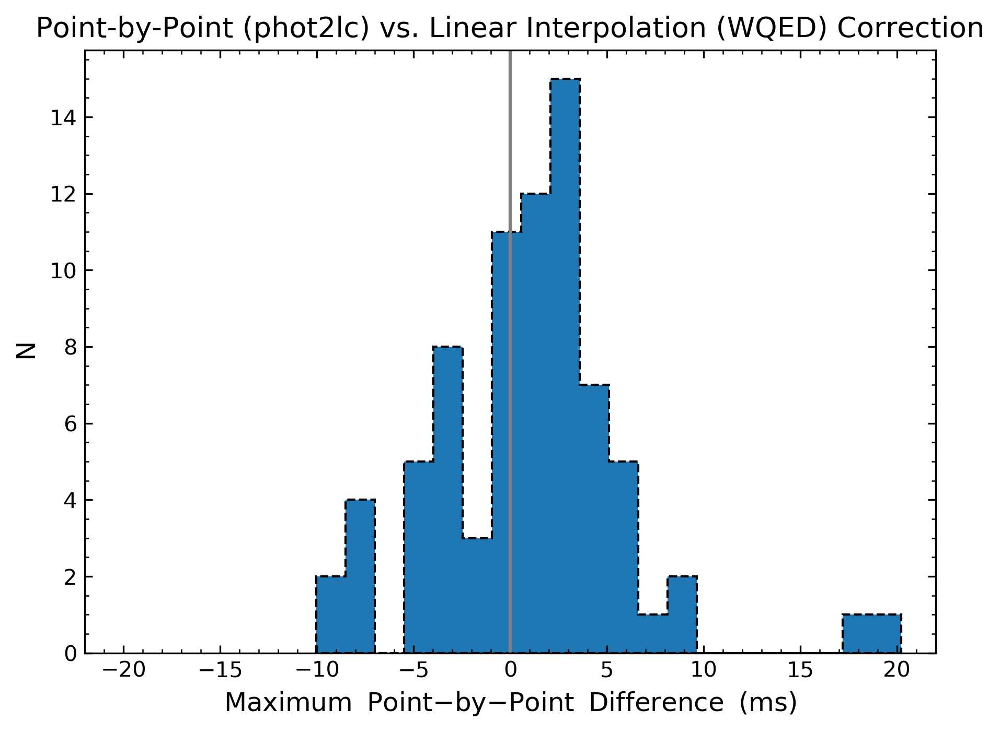

Barycentric Corrections
=======================

While most of what phot2lc does is relatively straightforward, the barycentric time corrections are perhaps the most important and easily mishandled part of this program. phot2lc uses the `Astropy Time package <https://docs.astropy.org/en/stable/time/#>`_ to perform point-by-point barycentric time corrections which account for the observed object's sky coordinates, the Earth location of the observatory from which the observations were made, the date and time at which the observations were made, and the number of leap seconds that have occurred. If any of these four pieces of information are incorrect, the barycentric time corrections will be unreliable. The sources for each piece of information are listed below:

* **Object Coordinates** come from stars.dat 
* **Observatory Location** is identified using the telescope code (e.g. mcd2, lco1, pjmo, etc.)
* **Observation Date-Time** comes from the image time stamps
* **Leap Seconds** are now `automatically checked and updated by Astropy (v4.0 or later) <https://docs.astropy.org/en/stable/whatsnew/4.0.html#whatsnew-4-0-time-leap-seconds>`_

Common sources of timing errors include typos in the stars.dat file, using the wrong coordinate epoch (must be J2000!), using the wrong object name which would load the wrong coordinates from stars.dat, using the wrong telescope code for your reductions, using an outdated leap seconds file (hopefully not since Astropy auto-updates it now), or perhaps errors in the raw time stamps for your images. It is always worth double checking these pieces of information throughout your reduction process!

Verification
------------

To verify that phot2lc is providing accurate barycentric corrections, a comparison with the corrections from other programs (WQED and `UTC2BJD <http://astroutils.astronomy.ohio-state.edu/time/utc2bjd.html>`_) has been performed for 73 different objects with a total of 138 light curves. Distributions of Barycentric Julian Date (BJD) differences between these programs are shown below, which are calculated using the mid-exposure time of the first data point for each light curve.

.. figure:: ./images/bjd_comparisons.png
  :width: 600
  :align: center
  :alt: BJD Differences

  Distributions of BJD differences between phot2lc, WQED, and UTC2BJD.

The distribution of BJD differences between phot2lc and WQED is much broader than with UTC2BJD, but WQED does not take into account the Earth location of the observatory used, whereas both phot2lc and UTC2BJD do. The excellent agreement with UTC2BJD suggests that taking the Earth location into account corrects most of the larger disagreements between phot2lc and WQED, which max out at around 50 milliseconds for this sample. While this is often much less than the timing uncertainties associated with image acquisition, the improved accuracy certainly doesn't hurt and with Astropy is a very easy correction to perform.

Another difference between phot2lc and WQED is the point-by-point correction method. WQED performs barycentric corrections by calculating a linear interpolation between the first data point's time stamp and a time stamp 0.5-days later. phot2lc, on the other hand, performs a barycentric correction for each point individually. This difference is expected to result in only minor changes in the timing corrections, often different by a few milliseconds or less, but can occasionally reach higher. In our sample, only one out of 73 objects exceeded a 10ms correction difference due to the point-by-point method (see figure below), again much smaller than the typical timing uncertainties.

  Distribution of the largest difference in corrections per light curve when performing a point-by-point (phot2lc) versus linear interpolation (WQED) correction method.

