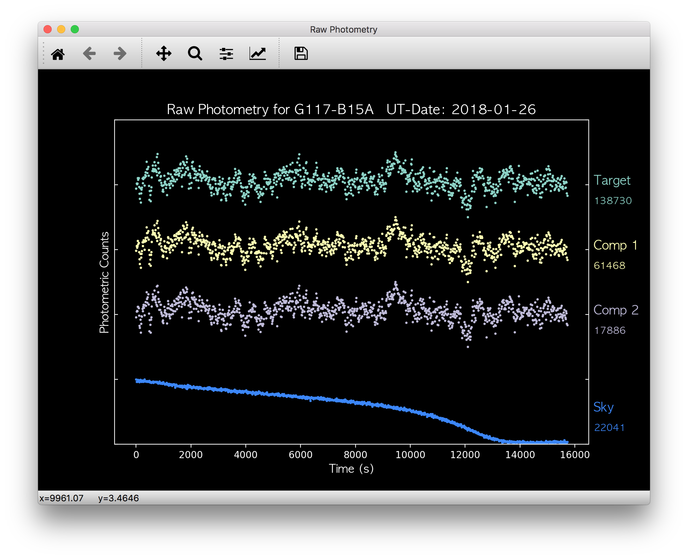
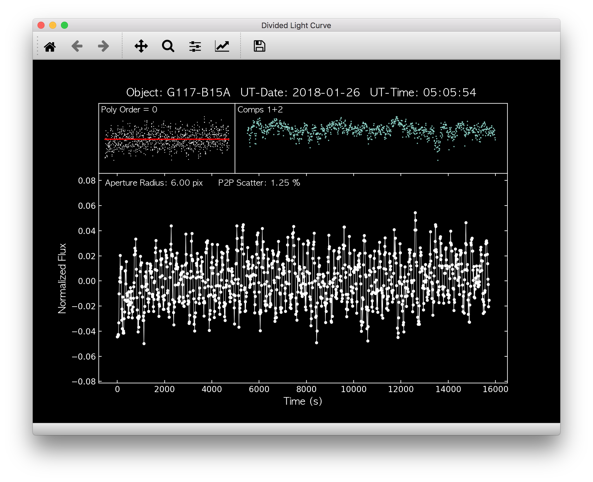

Quickstart
==========

This quickstart guide assumes you have already performed aperture photometry using either IRAF's ccd_hsp or the Matlab-based MAESTRO software, and have already :ref:`configured phot2lc<Configuration>` to run properly on your machine. 

Basic Usage
-----------

phot2lc is a command line tool, and can be executed from the command line by simply typing 

.. code-block:: bash

   phot2lc

phot2lc also has several command line arguments available which can be used individually, or all at once:

.. code-block:: text

  -h --help      Show command line options
  -c --codes     Print a list of available telescope codes
  -t --telescope Code name for telescope used
  -s --source    Code name for photometry program used
  -i --image     Name of specific image instead of list
  -o --object    Name of object matching stars.dat entry

If these command line options are used, they will override the defaults that are set within the config.dat file by the photconfig program.

Input Files
-----------

For ccd_hsp output, phot2lc will assume the photometry files have base names of *runbase* followed by the aperture size (e.g. runbase2.5), while for MAESTRO output the photometry files are assumed to have base names of *counts*, again followed by the aperture size (e.g. counts_02.5).

In addition, the following files/info should be present:

* stars.dat (or another file with object names and RA-Dec coordinates)
* The first FITS image (or all images within **image_list_name**)
* If available, the file pointed to by **pixloc_name**
* An entry within teledat.py corresponding to your telescope/instrument
  
  * If need to add a new entry into teledat.py, you can do this yourself by editing the teledat.py file, or :ref:`send a request to Zach Vanderbosch<Contact>` to add your telescope into the official phot2lc package.

Startup
-------

Once you have started phot2lc and it successfully loads all the necessary files, the following windows will pop up:

.. figure:: ./images/first_image.png
  :width: 500
  :align: center
  :alt: First Image

  Window displaying the first image. The target and comparison stars are marked if a **pixloc_name** file was provided, otherwise this will just be an unmarked image.

  Window displaying the raw photometry for target and comparison stars, along with the amount of sky subtracted from the target. The mean values are displayed to the right of each light curve.

  Window primarily displaying the divided light curve, but also displaying the summed comparison star flux (top right panel) and the polynomial being used to de-trend the light curve (top left panel).

Commands
--------

After startup and once you have clicked within one of the windows, you can print out a full list of commands in your terminal by pressing "?". The output will look like the following:

.. code-block:: text

  COMMAND LIST - Divided Light Curve:
    - Type '?' to re-print this list of commands.
    - Type 'd' to delete the point nearest the cursor.
    - Type 'a' to add back a deleted point.
    - Type 'A' to add back ALL deleted points.
    - Type 'g' to activate/deactivate garbage rectangle.
    - Type 'r' to activate/deactivate reverse garbage rectangle.
    - Type 'z' to activate/deactivate zoom rectangle.
    - Type 'Z' to restore zoom to original.
    - Type 'x' to perform sigma clipping.
    - Type 's' to toggle the display of deleted points.
    - Type 'f' to choose the degree of polynomial fit.
    - Type 'c' to choose comparison stars for division.
    - Type 'v' to move to previous aperture size.
    - Type 'w' to move to next aperture size.
    - Type 'Q' to close plots and exit the program.
    - Type 'W' to close plots and continue without grid search.
    - Type 'G' to close plots and continue with grid search.

  COMMAND LIST - Aperture Selection:
    - Type '?' to re-print this list of commands.
    - Type 'd' to delete the point nearest the cursor.
    - Type 'A' to add back all deleted points.
    - Type 'Q' to close plots and exit the program.
    - Type 'W' to save lightcurve with *USER* Selection.
    - Type 'G' to save lightcurve with *GRID* Selection.

The "Divided Light Curve" command list provides your options when you are working within the divided light curve window. Within the first image and raw photometry windows, the only commands available are "?", "Q", "W", and "G". The other command list for aperture selection is for the next window that appears if you decide to continue light curve extraction by typing the "W" or "G" keys when working in the divided light curve window.

For more detailed explanations of each command, see the PDF version of the phot2lc user guide (coming soon!).

Aperture Selection
------------------

Once you are satisfied with your selections in the divided light curve window and have chosen to continue by pressing the "W" or "G" key, a new window will appear showing the optimal light curve along with its periodogram. Also shown is a plot of average point-to-point (P2P) scatter as a function of aperture size. This is the criterion used to select the optimal light curve, that with the lowest P2P scatter.

.. figure:: ./images/aperture_selection_user.png
  :width: 500
  :align: center
  :alt: First Image

  The optimal light curve and aperture selection from the USER selected comparison stars.

.. figure:: ./images/aperture_selection_grid.png
  :width: 500
  :align: center
  :alt: First Image

  The optimal light curves and aperture selections from both the USER (white) and GRID (red) selected comparison stars.
